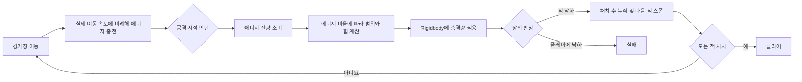

# Momentum Arena

> 이동으로 모은 에너지를 충격파로 방출해 적을 경기장 밖으로 밀어내는 3D 액션 게임


## 대표 플레이

> **GIF 배치 위치 — 핵심 게임 루프**
>
> `이동하며 에너지 충전 → 적을 유인 → 충격파로 여러 적을 장외로 밀어내기`가 한 번에 보이는 6~10초 분량의 GIF를 배치합니다.
>
> 권장 파일: `Docs/Media/momentum-arena-gameplay.gif`

<!-- 촬영 후 아래 주석을 해제하세요.

-->

> **플레이 영상 링크 배치 위치 — 전체 플레이**
>
> 시작 화면부터 모든 적을 처치해 클리어하는 과정까지 1~2분으로 편집한 영상을 연결합니다.
>
> 권장 플랫폼: YouTube(일부 공개) / Vimeo  
> 권장 썸네일: `Docs/Media/momentum-arena-video-thumbnail.png`

<!-- 업로드 후 아래 예시의 URL을 교체하고 주석을 해제하세요.
[](https://youtu.be/VIDEO_ID)
-->

## 프로젝트 소개

**Momentum Arena**는 이동할수록 에너지가 충전되고, 모은 에너지를 한 번의 충격파로 방출해 적을 장외로 밀어내는 3D 액션 프로토타입입니다.

일반적인 체력 기반 전투 대신 **이동, 축적, 위치 선정, 물리 넉백**을 하나의 전투 흐름으로 연결했습니다. 플레이어는 계속 움직이며 공격 자원을 확보해야 하고, 에너지를 오래 모을수록 더 넓고 강한 충격파를 사용할 수 있습니다. 공격 시 에너지를 전부 소비하므로 빠르게 견제할지, 위험을 감수하고 강한 한 방을 준비할지 판단해야 합니다.

캐릭터 모델이나 애니메이션 같은 외부 아트 에셋은 사용하지 않았습니다. Unity 기본 Primitive와 Material만으로 플레이 가능한 전투 루프를 구성해, 비주얼 제작보다 **게임 규칙과 코드 구조, 물리 상호작용 검증**에 집중했습니다.

| 항목 | 내용 |
| --- | --- |
| 장르 | 3D 액션 / 아레나 / 물리 기반 넉백 |
| 개발 형태 | 개인 프로토타입 |
| 엔진 | Unity 6000.3.20f1 |
| 언어 | C# |
| 렌더링 | Universal Render Pipeline 17.3.0 |
| 주요 패키지 | Input System 1.19.0, uGUI 2.0.0, TextMesh Pro |
| 그래픽 구성 | Unity Primitive 및 기본 Material |
| 대상 플랫폼 | PC |

## 게임 목표와 규칙

- 플레이어는 경기장에서 적의 접근을 피하며 이동해 에너지를 충전합니다.
- 마우스 왼쪽 버튼을 누르면 현재 에너지를 모두 소비해 원형 충격파를 발생시킵니다.
- 에너지가 많을수록 충격파의 범위와 넉백 힘이 증가합니다.
- 충격파로 적을 경기장 밖으로 밀어내면 해당 적을 처치합니다.
- 총 10명의 적을 모두 처치하면 게임을 클리어합니다.
- 플레이어가 경기장 아래로 떨어지면 게임에 실패합니다.
- 적은 최대 4명까지 동시에 등장하며, 4개의 스폰 지점에서 순차적으로 생성됩니다.

### 조작법

| 입력 | 동작 |
| --- | --- |
| `W`, `A`, `S`, `D` | 카메라 방향을 기준으로 이동 |
| 마우스 이동 | 3인칭 카메라 회전 |
| 마우스 왼쪽 버튼 | 보유 에너지를 모두 소비해 충격파 공격 |

## 핵심 플레이 흐름



## 주요 구현

### 1. 카메라 기준 3인칭 이동

`CharacterController`를 이용해 플레이어 이동과 중력을 처리했습니다. 카메라의 전방·오른쪽 벡터에서 Y축 성분을 제거한 뒤 입력과 조합하므로, 카메라가 위아래를 바라보더라도 지면을 기준으로 일관된 방향으로 이동합니다.

이동 방향이 존재할 때는 `Quaternion.RotateTowards`로 캐릭터를 부드럽게 회전시키며, 입력 여부가 아니라 프레임 사이의 **실제 위치 변화량**으로 현재 이동 속도와 이동 상태를 계산합니다.

### 2. 움직임을 공격 자원으로 바꾸는 에너지 시스템

에너지는 플레이어가 지면 위에서 실제로 이동할 때만 충전됩니다. 현재 이동 속도를 최대 이동 속도로 정규화해 충전량에 반영하므로, 정상 속도로 움직일수록 더 빠르게 에너지가 쌓입니다.

단순히 이동 키 입력만 검사하지 않고 실제 변위를 확인해, 벽을 향해 키를 누르고 있거나 이동이 제한된 상황에서 에너지가 충전되는 문제를 방지했습니다. 에너지 값이 변할 때는 `EnergyChanged` 이벤트를 발행해 UI가 게임 로직을 매 프레임 조회하지 않고 필요한 순간에만 갱신되도록 구성했습니다.

### 3. 에너지에 비례하는 충격파 공격

공격 시 현재 에너지를 전부 소비하고, 소비한 에너지 비율을 이용해 다음 값을 보간합니다.

| 에너지 상태 | 충격파 반경 | 수평 넉백 힘 |
| --- | ---: | ---: |
| 최소 | 2.0 | 4.0 |
| 최대 | 4.5 | 16.0 |

`Physics.OverlapSphere`로 범위 안의 적을 탐색한 뒤 `Rigidbody.AddForce(..., ForceMode.Impulse)`로 바깥 방향의 충격량과 수직 상승 힘을 적용합니다. 하나의 적이 여러 Collider를 보유하더라도 같은 공격에 힘이 중복 적용되지 않도록, 처리한 `Rigidbody`를 `HashSet`으로 관리했습니다.

### 4. 코드로 생성한 충격파 피드백

별도 VFX 에셋 없이 `LineRenderer`의 점들을 원형으로 배치해 충격파 링을 구현했습니다. 링은 짧은 시간 동안 목표 반경까지 확장되고, 동시에 선의 두께와 알파값이 감소합니다. 에너지 비율에 따라 색상도 변하도록 구성해 공격의 강도를 시각적으로 전달합니다.

> **GIF 배치 위치 — 충격파 비교**
>
> 에너지가 적을 때와 가득 찼을 때의 공격 범위·색상·넉백 차이를 좌우 비교 GIF로 보여줍니다.
>
> 권장 파일: `Docs/Media/shockwave-comparison.gif`

<!--  -->

### 5. 넉백을 보존하는 적 추적 AI

적은 `Rigidbody` 기반으로 플레이어를 추적하며 가속과 감속을 적용해 목표 수평 속도에 접근합니다. 전방으로 Raycast를 발사해 지면이 존재하는지 확인하기 때문에, 추적 중 스스로 낭떠러지로 걸어가는 행동을 억제합니다.

충격파에 맞은 직후에는 현재 수평 속도가 회복 기준보다 높은지를 검사해 AI 이동을 일시 중단합니다. 이 구간에서는 기존 `Rigidbody` 속도를 덮어쓰지 않으므로, 충격파가 만든 물리적 넉백이 자연스럽게 유지됩니다. 적이 감속해 정상 속도로 돌아오면 다시 추적을 시작합니다.

> **GIF 배치 위치 — 적 AI와 장외 처치**
>
> 적이 경기장 가장자리 앞에서는 멈추지만, 충격파에 맞으면 AI 제어보다 물리 충격이 우선되어 낙하하는 장면을 촬영합니다.
>
> 권장 파일: `Docs/Media/enemy-ai-knockback.gif`

<!--  -->

### 6. 제한된 동시 개체 수를 관리하는 스폰 시스템

적은 4개의 스폰 지점을 순환하며 일정 간격으로 생성됩니다. 전체 생성 수와 현재 생존 수를 별도로 관리해 총 10명의 적을 생성하되, 동시에 존재하는 적은 최대 4명으로 제한했습니다.

활성 적은 `HashSet`으로 관리하고 각 적의 낙사 이벤트를 구독합니다. 모든 적이 생성되었고 활성 적이 한 명도 남지 않았을 때 `AllEnemiesDefeated` 이벤트를 한 번만 발생시켜 클리어 조건을 확정합니다.

### 7. 이벤트 기반 게임 흐름과 UI

게임 상태를 `WaitingToStart`, `Playing`, `Cleared`, `Failed`로 구분했습니다. 중앙의 `GameFlowController`가 플레이어 낙사와 전체 적 처치 이벤트를 구독하고, 결과에 따라 입력·카메라·커서·UI·시간 흐름을 함께 전환합니다.

시작 전과 게임 종료 후에는 `Time.timeScale`을 0으로 설정하고, 시작·클리어·실패 패널에서 게임 시작, 재시작, 종료를 제어합니다. 에너지 게이지는 현재 비율에 따라 길이와 색상이 함께 변해 공격 자원의 상태를 즉시 확인할 수 있습니다.

## 문제 해결 과정

### 이동 입력만으로 에너지가 충전되는 문제

**문제**  
키 입력만 기준으로 충전하면 벽에 막혀 실제로 움직이지 않는 상황에서도 에너지를 얻을 수 있습니다.

**해결**  
`CharacterController.Move` 전후의 위치 차이에서 수평 이동 거리를 구하고, 이를 `deltaTime`으로 나눠 실제 이동 속도를 계산했습니다. 접지 여부, 입력 여부, 최소 실제 속도를 모두 만족할 때만 에너지를 충전하도록 조건을 구성했습니다.

```csharp
private void UpdateMovementState(Vector3 previousPosition)
{
    if (Time.deltaTime <= Mathf.Epsilon)
    {
        return;
    }

    Vector3 displacement = transform.position - previousPosition;
    displacement.y = 0f;

    CurrentMoveSpeed = displacement.magnitude / Time.deltaTime;
    IsMoving = CurrentMoveSpeed >= minimumMoveSpeed;
}

private bool CanChargeEnergy()
{
    return playerController != null
        && playerController.CanMove
        && playerController.IsGrounded
        && playerController.MoveInput.sqrMagnitude > 0.01f
        && playerController.IsMoving
        && playerController.CurrentMoveSpeed >= minimumChargeSpeed
        && CurrentEnergy < maximumEnergy
        && playerController.MoveSpeed > Mathf.Epsilon;
}
```

관련 코드: [`kms99400_PlayerController.cs`](Assets/_MomentumArena/Scripts/Player/kms99400_PlayerController.cs), [`kms99400_PlayerEnergy.cs`](Assets/_MomentumArena/Scripts/Player/kms99400_PlayerEnergy.cs)

**결과**  
플레이어가 공간 안에서 실제로 움직여야 공격 자원을 얻는다는 게임 규칙이 코드 수준에서도 일관되게 유지됩니다.

### 적 AI가 충격파의 물리 반응을 상쇄하는 문제

**문제**  
AI가 매 물리 프레임마다 추적 속도를 강제로 설정하면 `AddForce`로 적용한 넉백이 곧바로 약해지거나 사라질 수 있습니다.

**해결**  
적의 현재 수평 속도가 기준값을 초과하면 넉백 회복 상태로 판단하고, 그동안 AI가 `Rigidbody` 속도를 수정하지 않도록 했습니다. 공중에서도 같은 방식으로 물리 상태를 보존합니다.

```csharp
Vector3 currentVelocity = enemyRigidbody.linearVelocity;
Vector3 currentHorizontalVelocity =
    new Vector3(currentVelocity.x, 0f, currentVelocity.z);

IsGrounded = CheckGrounded();
IsRecoveringFromKnockback =
    currentHorizontalVelocity.sqrMagnitude >
    knockbackRecoverySpeed * knockbackRecoverySpeed;

// 물리 충격과 낙하 속도를 보존하기 위해 AI가 Rigidbody를 수정하지 않는다.
if (target == null || !CanMove || !IsGrounded || IsRecoveringFromKnockback)
{
    return;
}
```

관련 코드: [`kms99400_EnemyMovement.cs`](Assets/_MomentumArena/Scripts/Enemy/kms99400_EnemyMovement.cs)

**결과**  
추적 AI와 물리 기반 공격이 서로 충돌하지 않고, 강한 공격일수록 적이 더 멀리 밀려나는 손맛을 유지할 수 있습니다.

### 여러 Collider로 인한 중복 넉백 문제

**문제**  
`OverlapSphere`는 Collider 단위로 결과를 반환하므로, 하나의 `Rigidbody`에 여러 Collider가 연결되어 있으면 한 번의 공격에 힘이 여러 번 적용될 수 있습니다.

**해결**  
공격마다 처리한 `Rigidbody`를 `HashSet`에 기록하고 최초 한 번만 충격량을 적용했습니다.

```csharp
private readonly HashSet<Rigidbody> affectedRigidbodies = new();

// EmitShockwave 내부: 공격마다 처리 목록을 초기화한다.
affectedRigidbodies.Clear();

Collider[] hitColliders = Physics.OverlapSphere(
    center,
    radius,
    enemyLayerMask,
    QueryTriggerInteraction.Ignore);

for (int i = 0; i < hitColliders.Length; i++)
{
    ApplyKnockback(hitColliders[i], center, knockbackForce);
}

private void ApplyKnockback(
    Collider hitCollider,
    Vector3 center,
    float knockbackForce)
{
    Rigidbody targetRigidbody = hitCollider.attachedRigidbody;

    if (targetRigidbody == null || targetRigidbody.isKinematic)
    {
        return;
    }

    if (!affectedRigidbodies.Add(targetRigidbody))
    {
        return;
    }

    Vector3 direction = CalculateKnockbackDirection(targetRigidbody, center);
    Vector3 impulse = direction * knockbackForce + Vector3.up * upwardForce;
    targetRigidbody.AddForce(impulse, ForceMode.Impulse);
}
```

관련 코드: [`kms99400_ShockwaveEmitter.cs`](Assets/_MomentumArena/Scripts/Combat/kms99400_ShockwaveEmitter.cs)

**결과**  
적의 Collider 구성과 관계없이 충격파의 힘이 예측 가능하게 유지됩니다.

## 시스템 구성

```text
Assets/_MomentumArena/
├── Materials/
│   ├── M_Enemy_Red.mat
│   └── M_Shockwave.mat
├── Prefabs/
│   ├── Camera/
│   │   └── Main Camera.prefab
│   ├── Enemy/
│   │   └── Enemy.prefab
│   ├── Player/
│   │   ├── Player.prefab
│   │   └── PlayerActions.inputactions
│   └── UI/
│       ├── EnergyGauge.prefab
│       ├── GameStartPanel.prefab
│       ├── ClearPanel.prefab
│       └── FailPanel.prefab
├── Scenes/
│   └── GameScene.unity
└── Scripts/
    ├── Camera/
    │   └── kms99400_ThirdPersonCamera.cs
    ├── Combat/
    │   ├── kms99400_ShockwaveEmitter.cs
    │   └── kms99400_ShockwaveVisual.cs
    ├── Enemy/
    │   ├── kms99400_EnemyMovement.cs
    │   ├── kms99400_EnemySpawner.cs
    │   └── kms99400_EnemyFallDeath.cs
    ├── Game/
    │   └── kms99400_GameFlowController.cs
    ├── Player/
    │   ├── kms99400_PlayerController.cs
    │   ├── kms99400_PlayerEnergy.cs
    │   ├── kms99400_PlayerAttack.cs
    │   └── kms99400_PlayerFallDeath.cs
    └── UI/
        └── kms99400_PlayerEnergyUI.cs
```

각 기능은 하나의 역할을 담당하는 컴포넌트로 분리했습니다. 플레이어 공격은 에너지와 충격파 컴포넌트를 조합하고, 스포너와 게임 흐름은 낙사 이벤트를 통해 결과를 전달받습니다. 또한 `RequireComponent`, Inspector Tooltip, `OnValidate`를 활용해 필요한 의존성과 설정 범위를 명확히 했습니다.

## 스크린샷 배치 설계

아래 이미지는 `Docs/Media/` 폴더에 저장하는 구성을 권장합니다. 같은 해상도와 카메라 비율을 사용하면 문서 전체가 일관되게 보입니다.

| 순서 | 권장 파일명 | 촬영 내용 | 보여줄 포인트 | 문서 배치 |
| ---: | --- | --- | --- | --- |
| 1 | `arena-overview.png` | 경기장, 플레이어, 적이 함께 보이는 전체 화면 | Primitive만으로 구성한 게임 공간과 가독성 | 프로젝트 소개 다음 |
| 2 | `energy-low.png` | 에너지가 거의 없는 상태 | 에너지 게이지의 초기 색상과 짧은 공격 범위 | 충격파 구현 설명 |
| 3 | `energy-full.png` | 에너지가 가득 찬 상태 | 게이지 색상 변화와 최대 공격 준비 상태 | `energy-low.png` 옆 |
| 4 | `multi-enemy-knockback.png` | 여러 적이 동시에 밀려나는 순간 | 범위 공격, Rigidbody 물리 반응 | 주요 구현 중 충격파 설명 |
| 5 | `game-clear.png` | 클리어 패널 | 전체 게임 루프 완성도 | 게임 흐름 설명 |
| 6 | `game-fail.png` | 플레이어 낙사 후 실패 패널 | 실패 및 재시작 흐름 | `game-clear.png` 옆 |

### 경기장 전체 화면

> **스크린샷 위치 — Arena Overview**  
> 권장 해상도: 1920×1080, UI와 에너지 게이지가 함께 보이도록 촬영

<!--  -->

### 에너지 단계 비교

> **스크린샷 위치 — Low Energy / Full Energy**  
> 동일한 카메라 구도에서 에너지 게이지와 충격파 차이를 비교할 수 있도록 촬영

<!--
| 낮은 에너지 | 최대 에너지 |
| --- | --- |
|  |  |
-->

### 게임 결과 화면

> **스크린샷 위치 — Clear / Fail**  
> 시작부터 결과와 재시작까지 게임 흐름이 완성되어 있음을 보여주는 용도

<!--
| 클리어 | 실패 |
| --- | --- |
|  |  |
-->

## 실행 방법

1. 저장소를 내려받습니다.
2. Unity Hub에서 프로젝트 폴더를 추가합니다.
3. Unity `6000.3.20f1` 버전으로 프로젝트를 엽니다.
4. `Assets/_MomentumArena/Scenes/GameScene.unity` 씬을 엽니다.
5. Play 버튼을 눌러 실행합니다.

## 회고 및 확장 방향

외부 아트 에셋 없이 시작해 게임의 재미를 만드는 핵심 규칙을 빠르게 검증했습니다. 특히 이동을 자원 획득으로 연결하고, 공격의 위력을 물리 넉백과 장외 판정으로 표현하면서 적은 수의 시스템만으로도 명확한 플레이 사이클을 만들 수 있었습니다.

향후에는 다음 기능을 확장할 수 있습니다.

- 에너지 보유량에 따른 이동 이펙트와 사운드 피드백 추가
- 서로 다른 질량, 이동 패턴, 넉백 저항을 가진 적 타입 추가
- 웨이브별 난이도 조절과 생존 시간·점수 시스템 추가
- 카메라 충돌 처리와 공격 시 화면 흔들림 추가
- 오브젝트 풀링을 적용한 적 생성 및 재사용 구조
- 게임패드 입력과 옵션 UI 지원

---

> 이 문서는 프로젝트의 실제 코드와 Unity 설정을 기준으로 작성했습니다.  
> 공개 전 대표 GIF, 스크린샷, 플레이 영상 링크를 위 플레이스홀더에 추가하면 포트폴리오 문서가 완성됩니다.
